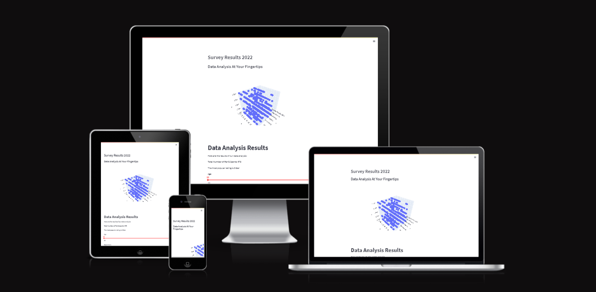
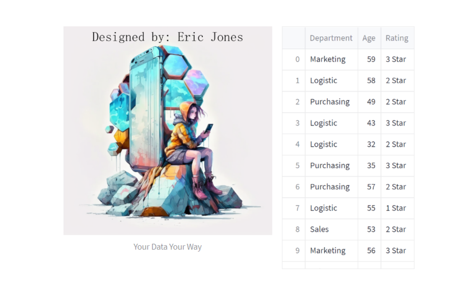
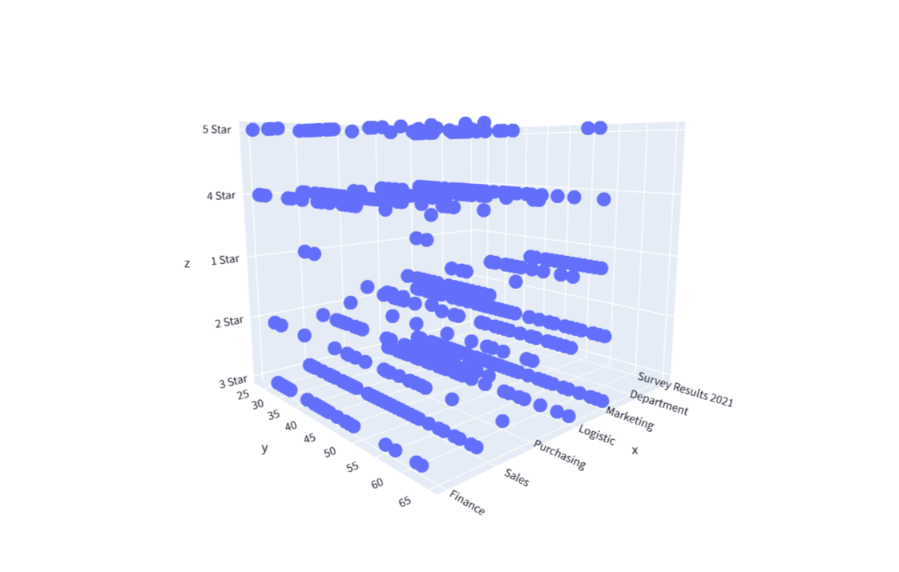
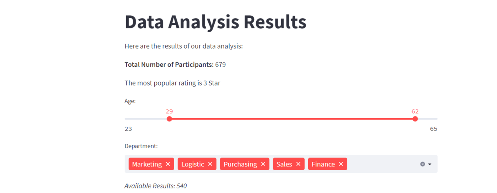
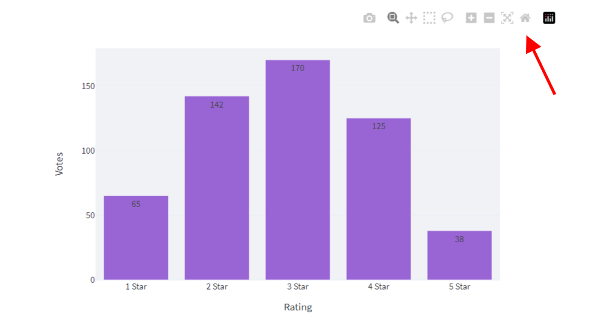
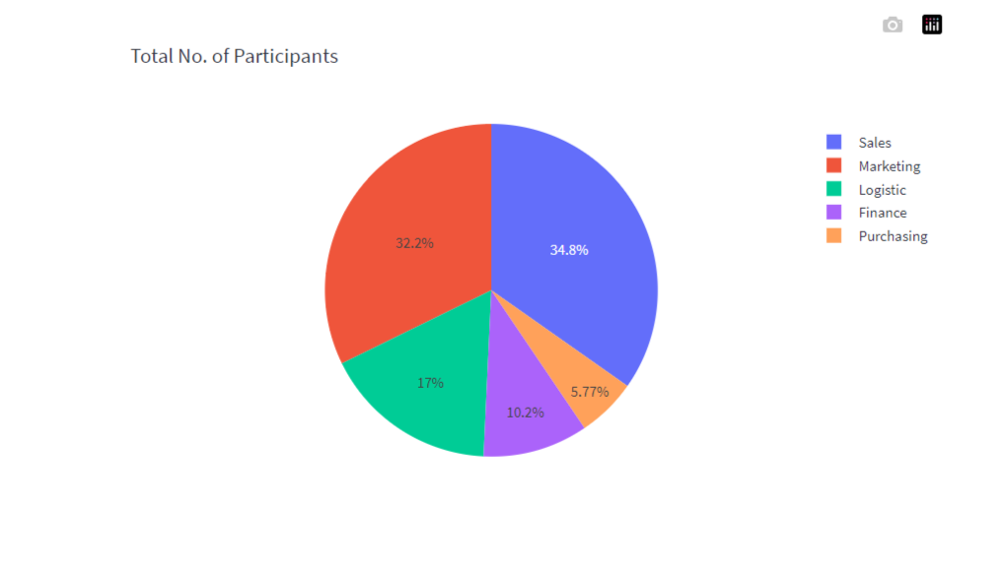
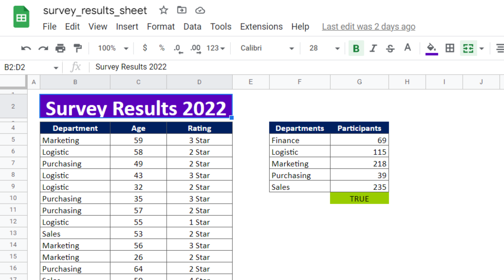
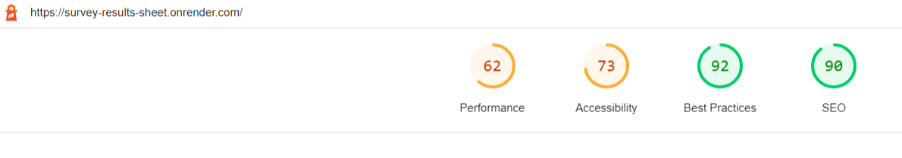

# Survey Results Sheet - Project 3

### Check out the live website: <a href="https://survey-results-sheet.onrender.com/">Survey Website</a>

## 1. Project Overview

### 1.1 Objective

The primary objective of the project is to utilize the power of Python modules to manipulate user data for a respective customer and output this data into clear and usable information.

The end-user can then glean important insights from the results of their survey and positively calculate, plan and react in a more efficient manner.

### 1.2 User Stories

#### First time users:

* As a first time user I want an excellent visual experience
* As a first time user I want to quickly understand what the site is about.
* As a first time user I want easily manipulate sight data for clarity.
* As a first time user I want the ability to easily navigate the site.
* As a first time user I want to easily distingish this site as a trusted site which is safe to use.

#### Returning Users:

* As a returning user I would like to see regular updates.
* As a returning user I would like to download data information.
* As a returing user I would like to learn more about the subject matter.

### 1.3 Design

This site is using a combination of the Python libraries gspread, pandas, and streamlit to connect to a Google Sheets document, retrieve data from it, and then create a web page for displaying that data using visualizations. 

The web page configuration is set using streamlit and the visualizations are created using plotly.express. This negated the need for an index.html, css file, and other codes normally attributed to interact web design.

The data is also filtered based on user input using streamlit widgets, and then the filtered data is used to create additional visualizations using plotly.express. Finally, the resulting web page is served using streamlit. A massive undertaking!

## 2 Features

### 2.1 Sections

The website consists of a single page with several sections. The first section includes a header and subheader, displayed at the top of the page. The page also includes a 3D scatter plot, which is created using data from a Google Sheets document and displayed using the plotly.express library. 

This 3D plot element retrieves information from a google cloud spreadsheet, found at the following address: bit.ly/3VItB0A

This document will also be used for future iterations of the project, which will be explained later within this document.

Below the scatter plot, there is a section which includes information about the total number of participants in the data and the most popular rating from the data. 

Within this area is an orange slider, with which the end-user can edit the results of the survey to his/her liking. There is functionality within the code that allows for the dynamic altering of the bar graph data below it.

Within this widget, as well as all others within the website, the user is able to download site data in several formats, including image format.

The website text is created using streamlit's st.markdown function. There are also several streamlit widgets on the page, including a slider and a multiselect widget, which allow the user to filter the data displayed on the page. 

The filtered data is then used to create additional visualizations, including a bar chart and a pie chart, using plotly.express. These visualizations are displayed below the widgets. Overall the website is designed to allow users to explore and analyze data from Google Sheets document through interactive and editable visualizations.

This website actually reference TWO google spreadsheets. One Google cloud spreadsheet, to coded to render the 3D plotter and for future developement and one .xlsx spreadsheet for the body of the website.

### 2.2 Future development

Additional features that are desired to be developed and implemented are as follows:

1. An additional window widget or page which embeds the Google Cloud spreadsheet within the website. This sheet will be able to take in user data to manipulate the information within the pre-existing site widgets.
2. Dynamic Survey Creation module: Used to create, implement and service new surveys within the site, as needed by the end-user.
3. User Experience: Additional code and applications that make the site more responsive and easier to use. The Streamlit module presently only affords for basic website functionality, but promise within documentation to offer more robust features in the future.

## 3 Testing

There was extensive testing ran on two separate hosting platforms:

1. Heroku
2. Render

The working website is currently hosted on the Render.com platform, as some functionality issues are currently preventing a successful page rendering within the Heroku platform.

For future reference, and upon successful deployment to heroku, that versaion of the website can be viewed here: https://surveysavy.herokuapp.com/

Some of the problems experienced are as follows:

1. Dynos accrual/implementation: The Procfile had to be adjusted to enable the web GUI on the Heroku dashboard to allow the manual manipulation of Dynos. This, along with documentation issues regarding how many dynos to deploy and for which situation(s) made created additional complication.
2. Once Dynos were implemented there seems to be an application errors related to boot timeouts as well as networking issue. Based on time constraints it was decided to continue to host the site on Render.com, thus showing definitively that a safe and stable deploy was indeed possible.
3. Google API crashing Render site. During the process of troubleshooting the Heroku website issues, as the same base code was being used to push updates to the same git repo, an old API key was inadvertently pushed to github. This was resolved by deleting the old key and creating an entirely new user/key combination and pushing this to both builds.

The lighhouse Google built-in dev tool was used to gauge user experience and page load. Improvements to these gradings will come in a future iteration of the program.

## 4 Deployment

1. Navigate to the Render or Heroku Dashboard
2. Implement local copy of CREDS JSON file within the Render and Heroku security dashboards
3. Ensure all dependencies within the local and remote files are met.
4. Select the deploy from branch (main branch) from dashboard(s)
5. Upon succesful completion of build and zero errors returned, view the live site.

## 5 Credits

### 5.1 Images

Original artwork created by Eric Jones

### 5.2 Tutorials

"Turn Your Excel File Into A Web App With Python (fast & easy) | Streamlit Tutorial" by Coding is Fun
Link:https://youtu.be/7zeAIEPJaoQ